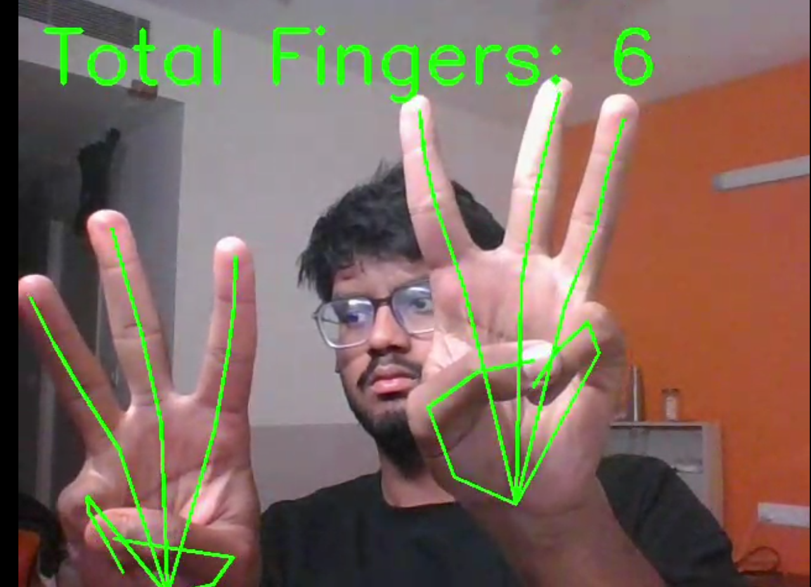
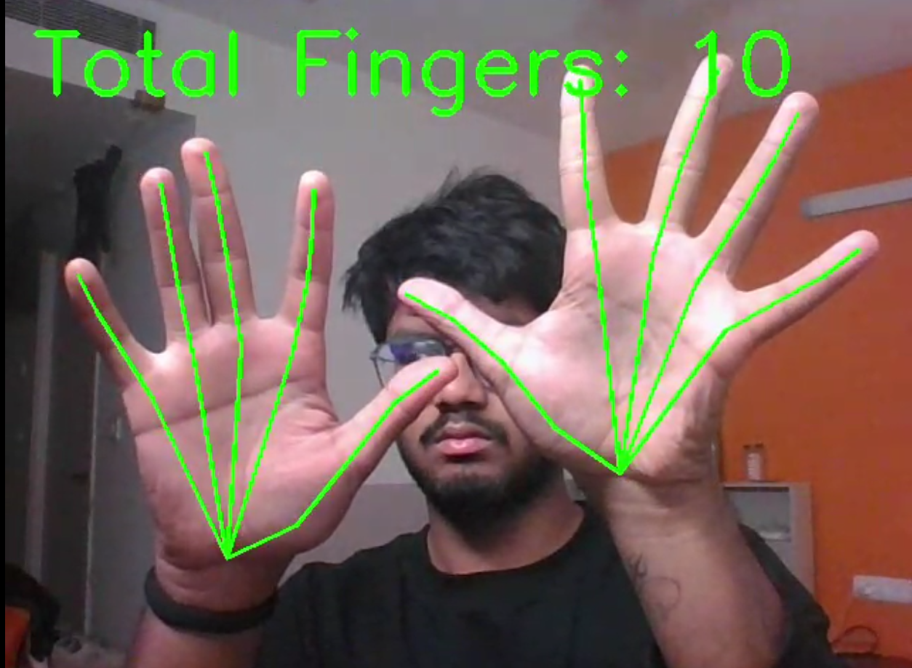

# Finger Counting using Computer Vision

This project detects and counts the number of fingers in real-time using a webcam.

## 🚀 Features
- Real-time hand detection
- Finger counting using geometric (angle-based) logic
- Supports multiple hands
- Smooth output using buffering

## 🧠 How it works
MediaPipe detects 21 hand landmarks.
Angles between finger joints are calculated:
- Straight finger → large angle → counted
- Bent finger → small angle → ignored

## 🛠 Tech Stack
- Python
- OpenCV
- MediaPipe

## ▶️ Run
```bash
pip install opencv-python mediapipe
python finger_count.py


## 📸 Demo


